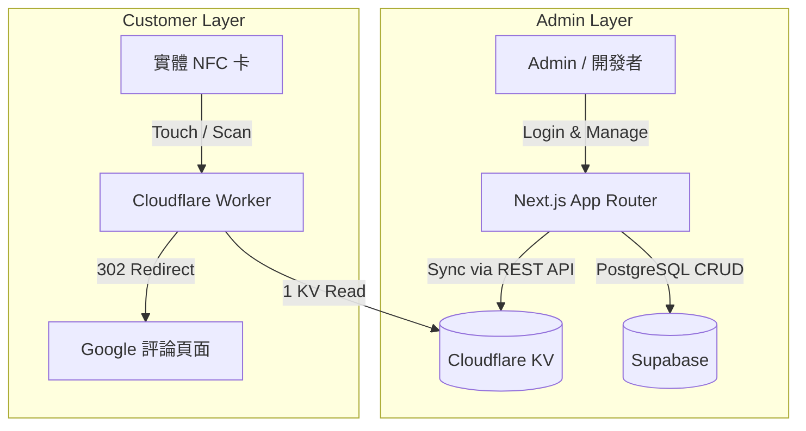

# NFC 管理平台架構說明 (第二階段 - 低成本優化版)

本文件說明「第二階段 NFC 評論卡管理平台」的系統架構，特別是為了降低資料庫成本與提升跳轉速度所做的 Cloudflare Worker + KV 優化。

## 系統架構圖

## 核心設計理念

1. **極速與低成本的 Redirect**
   - 顧客每次掃描 NFC 卡，流量只會進到 Cloudflare Worker 邊緣節點。
   - Worker 僅向 Cloudflare KV 讀取一筆資料，確認目的網址與狀態後，直接回傳 `302 Redirect`。
   - **不查 Supabase**、**不寫入 PostgreSQL**，確保資料庫不會因為大量掃描而超載，同時省去 DB 讀寫成本。

2. **Supabase 作為 Source of Truth**
   - 所有的商家資料、NFC 設定、狀態，依然存放在 Supabase 的關聯式資料庫中。
   - Cloudflare KV 只是為了「極速讀取」而存在的唯讀快取。

3. **遠端更新與 Eventually Consistent**
   - 當 Admin 在後台修改 NFC 的目的地時，Next.js 會依序：
     1. 呼叫 Cloudflare API 更新 KV。
     2. 更新 Supabase 資料，並標記 `redirect_sync_status = 'synced'`。
   - 若 KV 更新失敗，Supabase 仍可記錄新網址，但標記為 `'error'`，讓 Admin 可以稍後手動重試。

4. **NFC 實體卡片免重寫**
   - 每張 NFC 寫入的都是 `https://go.example.com/r/A83KD` 這類永久不變的短網址。
   - 所有後續的網址變更，全靠後端資料庫與 KV 來決定跳轉目標。

## 為什麼掃描不寫入 Supabase Analytics？
為了達到「極低成本」，我們在這一版暫時移除了每次掃描的 Supabase INSERT。這避免了在 Worker 中呼叫 Supabase API 帶來的延遲與資料庫連線負載。若未來需要 Analytics，建議使用 Cloudflare Analytics Engine 或在背景非同步處理，絕對不阻塞顧客的跳轉流程。
